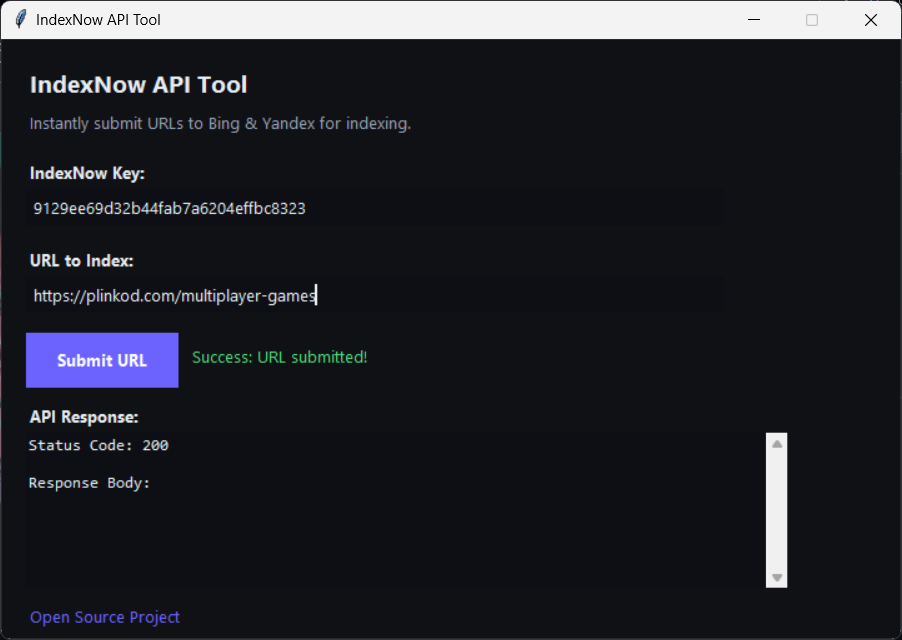

# IndexNow API Tool

A simple and modern Python GUI application that allows you to instantly submit URLs to the **IndexNow** API, supported by Bing and Yandex. This tool is designed to help creators and developers get their content indexed faster by notifying search engines immediately when pages are added.  
The tool was originally created to streamline indexing workflows used across several projects, including platforms like [Plinkod.com](https://plinkod.com/multiplayer-games), where fast visibility for new content is essential.

## Preview


## Features

- **Modern Dark UI**: Clean and comfortable interface built with Tkinter.
- **Instant Submission**: Sends URLs directly to the IndexNow endpoint.
- **Response Viewer**: View the raw JSON response or status codes from the API.
- **Key Management**: Automatically loads your API key from `indexnow_key.txt` if present.

## Prerequisites

- Python 3.6+
- `requests` library

## Installation

1. Clone the repository:
   ```bash
   git clone https://github.com/yourusername/indexnow-tool.git
   cd indexnow-tool
   ```

2. Install dependencies:
   ```bash
   pip install -r requirements.txt
   ```

## Usage

1. Run the application:
   ```bash
   python index-now-api.py
   ```

2. **Enter your IndexNow Key**:
   - You can generate one at [Bing Webmaster Tools](https://www.bing.com/indexnow).
   - *Tip*: Save your key in a file named `indexnow_key.txt` in the same directory to auto-load it.

3. **Enter the URL**:
   - Paste the full URL you want to index (e.g., `https://example.com/new-post`).

4. **Click Submit**:
   - The tool will send the request and show the API response below.

## Contributing

Contributions are welcome! Please feel free to submit a Pull Request.

## License

This project is open source and available under the [MIT License](LICENSE).

